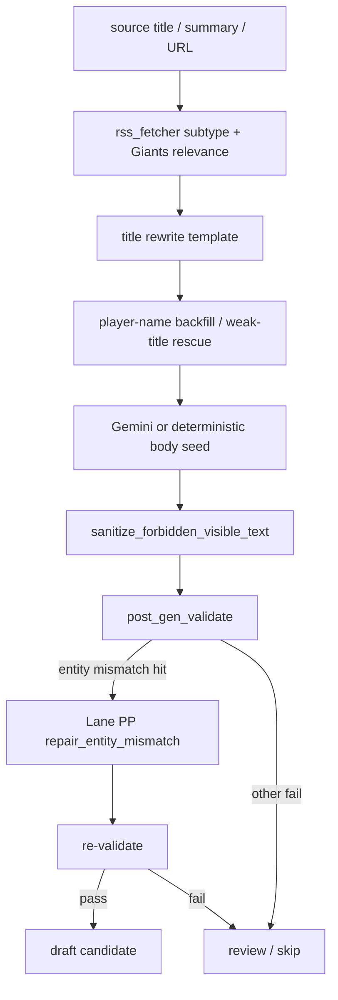

# 2026-05-04 Lane PP body quality v1 active repair + per-id preview

Scope:

- preview only
- production deploy / env apply / WP write / publish mutation なし
- Lane OO `d661ed3` の detection は維持し、Lane PP で narrow 拡張のみ追加
- 全 flag は default OFF のまま

Execution note:

- `2026-05-04 JST` に `WPClient.get_post()` で authenticated `GET /wp-json/wp/v2/posts/{id}` を 5 件試行
- sandbox では `yoshilover.com` の DNS 解決が失敗し、全件 `wp_fetch_failed`
- そのため Step 5 の current title / body は、incident ledger / Lane OO preview / Lane NN audit の **last-known evidence fallback** を併記している
- proposed 側は repo 内 dry-run runner `python3 -m src.tools.run_article_body_quality_preview` の出力を使用

## Step 1. Required Read-only Report

### 1.1 Target files

| area | files | note |
|---|---|---|
| title generation | `src/rss_fetcher.py`, `src/title_validator.py`, `src/title_player_name_backfiller.py`, `src/weak_title_rescue.py` | rewrite / reroll / weak-title review |
| body generation | `src/rss_fetcher.py` | Gemini prompt, subtype body template, sanitizer, `post_gen_validate` |
| quality guard | `src/article_quality_guards.py`, `src/article_entity_team_mismatch.py`, `src/baseball_numeric_fact_consistency.py` | forbidden phrase / generic title / quote / duplicate / entity mismatch / source grounding |
| Lane PP repair | `src/article_quality_repair.py` | deterministic entity-mismatch repair |
| preview runner | `src/tools/run_article_body_quality_preview.py` | read-only dry-run, per-id markdown preview |

### 1.2 Current generation flow



### 1.3 Forbidden phrase entry points

- template-visible heading family:
  - `【発信内容の要約】`
  - `【文脈と背景】`
  - `AI prompt`
  - `internal instruction`
- Gemini prompt contamination:
  - `src/rss_fetcher.py` social / manager / recovery prompt blocks
- post-process visible text:
  - `sanitize_forbidden_visible_text()` line replacement

### 1.4 Generic title entry points

- `_rewrite_display_title_with_template()` in `src/rss_fetcher.py`
- title reroll / rescue path before publish candidate acceptance
- weak subject false negative:
  - generic compounds such as `実施選手`
  - bench / postgame roundup suffixes

### 1.5 Quote break entry points

- raw Gemini body output
- `_extract_quote_phrases()` in `src/rss_fetcher.py`
- template rewrite that truncates or paraphrases around `「...」`

### 1.6 Entity mismatch entry points

- `is_giants_related()` / subtype classifier route
- `player_status_return` / `notice_v1` / `recovery_v1` title-body family
- `detect_source_entity_conflict()` in `src/article_quality_guards.py`

### 1.7 Preview-only execution

```bash
python3 -m src.tools.run_article_body_quality_preview
```

Behaviour:

- first tries authenticated WP REST `GET` only
- no `POST` / no `PUT`
- if fetch fails, falls back to per-id manifest evidence and still prints a preview
- sets Lane OO 6 flags + Lane PP 2 flags **inside process only**

### 1.8 Feature flags

| lane | flag | default | purpose |
|---|---|---|---|
| OO | `ENABLE_FORBIDDEN_PHRASE_FILTER` | OFF | forbidden phrase / prompt-heading reject |
| OO | `ENABLE_TITLE_GENERIC_COMPOUND_GUARD` | OFF | generic compound title review |
| OO | `ENABLE_QUOTE_INTEGRITY_GUARD` | OFF | broken quote reject |
| OO | `ENABLE_DUPLICATE_SENTENCE_GUARD` | OFF | repeated sentence reject |
| OO | `ENABLE_ACTIVE_TEAM_MISMATCH_GUARD` | OFF | source-side entity mismatch detect |
| OO | `ENABLE_SOURCE_GROUNDING_STRICT` | OFF | strict grounding review |
| PP | `ENABLE_H3_COUNT_GUARD` | OFF | H3 3+ reject |
| PP | `ENABLE_ENTITY_MISMATCH_REPAIR` | OFF | deterministic repair for `non_giants_team_prefix` only |

### 1.9 Rollback

1. Keep all 8 flags OFF. Live behavior remains unchanged.
2. Revert repo commit if preview code itself must be removed.
3. Delete preview runner / doc only if user rejects the approach.
4. No infra rollback is needed because this change set does not touch Cloud Run image / env / Scheduler.

## Step 2-4. Implementation summary

- `src/article_quality_guards.py`
  - forbidden phrase coverage extended for all requested 9 phrases plus `AI prompt / internal instruction`
  - generic title patterns extended for:
    - `昇格・復帰 関連情報`
    - `ベンチ関連発言`
    - `試合後発言整理`
    - `実施選手`
    - generic-subject-with-particle (`実施選手が...`)
  - `find_excessive_h3()` added
- `src/title_validator.py`
  - generic bench / postgame roundup titles now route to weak-title review when guard flag is ON
- `src/rss_fetcher.py`
  - `post_gen_validate` now accepts preview HTML and can reject `h3_count:too_many_h3`
  - entity mismatch hit can route into Lane PP deterministic repair
  - repaired case suppresses only the repaired `entity_mismatch:non_giants_team_prefix` axis and keeps any other fail axis intact
- `src/article_quality_repair.py`
  - new deterministic repair module
  - scope intentionally narrow:
    - only `non_giants_team_prefix`
    - title fallback to raw source title truncate
    - contamination strings replaced or rebuilt from source-grounded body
    - no Gemini call

## Step 5. Per-id preview

Common note:

- all 5 current-state reads fell back because authenticated WP REST GET failed in this sandbox on `2026-05-04 JST`
- current title/body below are therefore last-known repo-visible evidence, not a fresh live fetch

### 64445

- source title / URL:
  - `【巨人】松浦慶斗が初回から緊急リリーフ 大慌てで準備した舞台裏は… 先発・山崎伊織が２球で交代`
  - `https://twitter.com/hochi_giants/status/2050885171277099230`
- current title:
  - `【巨人】松浦慶斗が初回から緊急リリーフ 大慌てで準備した舞台裏は… 先発・山…`
- proposed title:
  - unchanged
- current body excerpt:
  - `【試合概要】 松浦慶斗が初回から緊急リリーフした。 【注目ポイント】 山崎伊織が2球で交代した直後の継投に注目です。`
- proposed body excerpt:
  - `【ニュースの整理】 松浦慶斗が初回から緊急リリーフした。 先発の山崎伊織が2球で交代した。 【次の注目】 この緊急登板が次の起用につながるかを見たいところです。`
- removed:
  - none
- preserved:
  - `松浦慶斗`
  - `山崎伊織`
  - `2球で交代`
- no-new-fact basis:
  - dry-run compare shows `extra_names=[] / extra_teams=[] / extra_numbers=[]`
  - score / quote / date 追加なし
- residual risk:
  - `current_wp_rest_fetch_unavailable`
- flag hits:
  - before repair: none
  - after preview: none

### 64443

- source title / URL:
  - `【巨人】ドラ２・田和廉が球団新を更新する１２試合連続無失点 ７回２死満塁→中断→降雨コールドで記録継続`
  - `https://twitter.com/hochi_giants/status/2050891541141483536`
- current title:
  - `ドラ２・田和廉が球団新を更新する１２試合連続無失点 ７回２死満塁→中断→降雨…`
- proposed title:
  - unchanged
- current body excerpt:
  - `【ニュースの整理】 田和廉が12試合連続無失点を球団新に伸ばした。 【次の注目】 この記録が次戦でも続くか見たいところです。`
- proposed body excerpt:
  - `【ニュースの整理】 田和廉が球団新となる12試合連続無失点を続けた。 7回2死満塁で中断し、そのまま降雨コールドで記録が継続した。 【次の注目】 この記録が次戦でも伸びるか見たいところです。`
- removed:
  - none
- preserved:
  - `田和廉`
  - `12試合連続無失点`
  - `7回2死満塁`
- no-new-fact basis:
  - `extra_names=[] / extra_teams=[] / extra_numbers=[]`
  - source titleにある数値だけを維持
- residual risk:
  - `current_wp_rest_fetch_unavailable`
- flag hits:
  - before repair: none
  - after preview: none

### 64461

- source title / URL:
  - `ブルージェイズ・岡本和真が3戦連発の9号2ラン　9回に反撃の一発放つも及ばず、勝率5割復帰お預け`
  - `https://baseballking.jp/ns/694662/`
- current title:
  - last-known contaminated ledger title = `岡本和真、昇格・復帰 関連情報`
  - user note says live article was manually narrowed later, but fresh WP GET could not verify that in sandbox
- proposed title:
  - `ブルージェイズ・岡本和真が3戦連発の9号2ラン 9回に反撃の一発放つも及ばず、勝率5…`
- current body excerpt:
  - `【故障・復帰の要旨】 岡本和真の状態を整理する。 【故障の詳細】 読売ジャイアンツ所属の岡本和真は調整を続けている。 ...`
- proposed body excerpt:
  - rebuilt to
  - `【ニュースの整理】 ブルージェイズ・岡本和真が3戦連発の9号2ラン ...`
  - `【岡本和真 近況】 元読売ジャイアンツ・現ブルージェイズの岡本和真に関する話題です。`
  - `【次の注目】 現ブルージェイズで次にどんな内容を見せるかを見たいところです。`
- removed:
  - `岡本和真、昇格・復帰 関連情報`
  - `読売ジャイアンツ所属の岡本和真`
  - `巨人復帰後`
- preserved:
  - `岡本和真`
  - `ブルージェイズ`
  - `3戦連発`
  - `9号2ラン`
  - `9回`
  - `勝率5割復帰お預け`
- no-new-fact basis:
  - `extra_names=[] / extra_numbers=[]`
  - derived team label allowance only:
    - `読売ジャイアンツ`
    - `巨人`
  - new試合事実 / quote / 数字は追加していない
- residual risk:
  - `current_wp_rest_fetch_unavailable`
  - `derived_former_giants_affiliation_label`
- flag hits:
  - before repair:
    - `h3_count:too_many_h3`
    - `entity_mismatch:non_giants_team_prefix`
  - after preview:
    - none
- result:
  - active repair pass

### 64453

- source title / URL:
  - `元巨人の上原浩治氏が井上尚弥と中谷潤人にあっぱれ「ラウンド中、息をするのも忘れるくらい」`
  - `https://www.nikkansports.com/baseball/news/202605030000454.html`
- current title:
  - raw-source近似 truncate family
- proposed title:
  - unchanged
- current body excerpt:
  - `【ニュースの整理】 上原浩治氏のコメントを整理する。 【ここに注目】 このコメントはファン必見です。 【次の注目】 この反応がどう広がるか気になります。`
- proposed body excerpt:
  - `【ニュースの整理】 上原浩治氏のコメントを整理する。 【ここに注目】 このコメントは押さえておきたい内容です。 【次の注目】 この反応がどう広がるか気になります。`
- removed:
  - `このコメントはファン必見です。`
- preserved:
  - `上原浩治氏`
- no-new-fact basis:
  - `extra_names=[] / extra_teams=[] / extra_numbers=[]`
- residual risk:
  - `current_wp_rest_fetch_unavailable`
  - `ob_non_baseball_relevance_remains_review_only`
- flag hits:
  - before repair:
    - `entity_mismatch:alumni_non_baseball_context`
  - after preview:
    - `entity_mismatch_repair:entity_mismatch_unrepairable:alumni_non_baseball_context`
- result:
  - repair不可、review hold維持

### 64432

- source title / URL:
  - `右アキレス腱炎からの復帰を目指す 投手がブルペン投球を実施`
  - `https://twitter.com/sanspo_giants/status/2051101291485733322`
- current title:
  - `実施選手、昇格・復帰 関連情報`
- proposed title:
  - `右アキレス腱炎からの復帰を目指す 投手がブルペン投球を実施`
- current body excerpt:
  - `【発信内容の要約】 【文脈と背景】 元記事の内容を確認中です。`
- proposed body excerpt:
  - `【投稿で出ていた内容】 【この話が出た流れ】 元記事の内容を確認中です。`
- removed:
  - `実施選手、昇格・復帰 関連情報`
  - `【発信内容の要約】`
  - `【文脈と背景】`
- preserved:
  - raw source titleのみ
- no-new-fact basis:
  - `extra_names=[] / extra_teams=[] / extra_numbers=[]`
- residual risk:
  - `current_wp_rest_fetch_unavailable`
  - `subject_still_unconfirmed_from_source_only`
  - `close_marker`
  - `placeholder_body:empty_section`
- flag hits:
  - before repair:
    - `close_marker`
    - `placeholder_body:empty_section`
  - after preview:
    - same
- result:
  - title only rescue可 / body publishable までは未到達

## Step 6. Tests

Targeted:

- `python3 -m pytest tests/test_article_quality_guards.py tests/test_title_validator.py tests/test_post_gen_validate.py tests/test_article_quality_repair.py`
- result: `59 passed / 0 failed`

Baseline:

- `python3 -m pytest`
- result: `2246 passed / 4 failed`
- fail set unchanged from pre-existing baseline:
  - `tests/test_draft_only.py::DraftOnlyTests::test_finalize_post_publication_publishes_and_saves_history`
  - `tests/test_sns_topic_publish_bridge.py::SNSTopicPublishBridgeTests::test_live_mode_respects_burst_cap_20`
  - `tests/test_sns_topic_publish_bridge.py::SNSTopicPublishBridgeTests::test_repairable_draft_goes_through_cleanup_chain`
  - `tests/test_sns_topic_publish_bridge.py::SNSTopicPublishBridgeTests::test_sns_derived_yellow_logged_into_yellow_log`

## Rollback

1. Keep all 8 flags OFF.
2. Remove `src/article_quality_repair.py` and Lane PP hooks from `src/rss_fetcher.py` if user rejects active repair.
3. Remove `src/tools/run_article_body_quality_preview.py` and this doc if preview runner itself is not wanted.
4. No production rollback is necessary because no image / env / scheduler update was performed.
