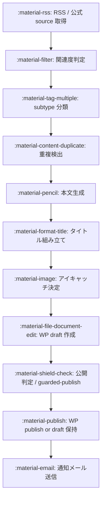

# :material-pipe: 記事生成パイプライン

!!! info "これは何"

    RSS / 公式 source から記事を取得して、 WordPress に下書き / 公開記事を生成する流れ。
    ヨシラバーの記事供給を支える ==中核 lane==。

## :material-arrow-down: 全体の流れ



各 step は独立した責務で、 env で任意の段階で skip / 強化できる。

## :material-rss: 1. RSS / source 取得

ファイル: `src/rss_fetcher.py`

`config/rss_sources.json` に登録された ==47 source== を読みにいく (2026-05-27 確認、 内訳は X feed 中心)。

代表 source:

- 巨人公式 X / 読売ジャイアンツ X
- スポーツ報知 X / サンスポ巨人 X / スポニチ X
- 日刊スポーツ X / 東スポ巨人 X / デイリー X
- NPB 公式 X / Number Web X / DAZN ベースボール X

各 source から URL / title / 本文 / 発行日時 / source 名 を取得。

## :material-filter-variant: 2. 関連度判定

巨人 (読売ジャイアンツ) と関係のない記事を弾く。

- 巨人選手の固有名詞 / 球団名 (巨人 / ジャイアンツ / Giants) を本文 / title でチェック
- 元巨人 OB は OK (菅野 / 岡本 / 阿部 など)
- 非元巨人 MLB は NG (大谷翔平 / 山本由伸 / ダルビッシュ など)

## :material-tag-multiple: 3. subtype 分類

出典: `PUBLISH_SUBTYPE_ENV_MAP` (`src/rss_fetcher.py:221`)

| subtype | 内容 |
| --- | --- |
| `postgame` | 試合後 (試合結果) |
| `pregame` | 試合前 |
| `lineup` | スタメン |
| `farm_lineup` | 二軍スタメン |
| `farm` | 二軍 |
| `manager` | 監督コメント / 起用方針 |
| `notice` | お知らせ |
| `recovery` | 故障 / 復帰 |
| `social` | 球団系 SNS の話題 |
| `player` | 選手個別 |
| `general` | 一般 |
| `game_note` | 試合に関するメモ |
| `roster` | 登録 / 抹消 |

別系統で `live_anchor` / `live_update` / `summary` / `comment` / `record` / `milestone` などもコード上で扱う。

!!! warning "分類は 100% 自動を狙わない"

    confidence が high の時だけ subtype を付ける。 曖昧 / facts 不足 / 複数候補は draft 落とし → review。
    ==LLM で分類確実化することは禁止== (rewrite 経由の分類は禁止)。

## :material-content-duplicate: 4. 重複検出

URL / canonical / 内容シグネチャで弾く。
同じ事象が複数 source から来ても、 最初の 1 件だけ採用。

## :material-pencil: 5. 本文生成

- 基本は ==source 本文を抜粋 + 整形==
- LLM で本文を「埋める」 のは ==禁止==
- source 不足は skip / review にする (Gemini で穴埋めしない)
- 報知 priority + 模倣しない: タイトル / 600 字抜粋 / セルフィーは報知 literal を一次 source 優先、 編集枠 (section 構成 / 軸 / 文体) は独自

## :material-format-title: 6. タイトル組み立て

タイトルは ==3 token literal assembly==。

```
{player}「{quote 20-40 字}」{event}
```

各 token は ==すべて source の literal== でないといけない。
LLM rewrite / narrative 化禁止。

例:

> 坂本勇人「最後まで集中して振り切れた」300号サヨナラホームラン

3 token が揃わなければ draft 落とし → review。 LLM で補完しない。

## :material-image: 7. アイキャッチ

3 段 fallback ([アイキャッチ](eyecatch.md) 参照):

1. 元記事のアイキャッチ
2. 保存済みの選手写真 (67 名分)
3. 巨人チームマーク (固定 media_id `63578`)

## :material-file-document-edit: 8. WP draft 作成

`src/wp_client.py` の `WPClient` 経由で post を新規作成。 default は `status=draft`。

!!! tip "RUN_DRAFT_ONLY=1"

    Cloud Run 上での生成はすべて draft 止まりになる安全 flag。

## :material-shield-check: 9. 公開判定 (guarded-publish)

別 Cloud Run Job `guarded-publish` (cron `*/30 * * * *`) が draft を判定:

- 品質 gate (本文長 / 構造)
- 事実 gate
- 重複 gate
- subtype 別の review reason
- title / body の整合性

合格 → `status=publish` に flip。 落ちたものは draft 保持 → review queue (通知メールの【要確認】) に流す。

## :material-email: 10. 通知メール

WP の状態 + review reason から、 publish-notice が per-post 通知を送る。
詳細は [通知メール (publish-notice)](publish-notice.md) を参照。

## :material-cog: 主な環境変数 (yoshilover-fetcher サービス 2026-05-27 実値)

??? abstract "クリックで展開"

    出典: `gcloud run services describe yoshilover-fetcher` 実行結果。

    | env | 実値 | 効果 |
    | --- | --- | --- |
    | `RUN_DRAFT_ONLY` | True | Cloud Run 上で publish に flip しない (常に draft 止まり) |
    | `PUBLISH_REQUIRE_IMAGE` | 1 | アイキャッチが無い post の publish を禁止 |
    | `AUTO_TWEET_ENABLED` | 0 | 0 で自動 X 投稿を停止 (user 手動運用) |
    | `AUTO_TWEET_REQUIRE_IMAGE` | 1 | 画像無しの X 投稿を禁止 |
    | `STRICT_FACT_MODE` | 1 | 事実 gate を厳格化 |
    | `LOW_COST_MODE` | 1 | Gemini 呼び出しを抑制 |
    | `ARTICLE_AI_MODE` | none | 記事生成は LLM 不使用 (==production は none==) |
    | `OFFDAY_ARTICLE_AI_MODE` | none | 試合のない日も LLM 不使用 |
    | `X_POST_AI_MODE` | gemini | X 投稿テキスト生成は Gemini |
    | `X_POST_DAILY_LIMIT` | 10 | X 投稿の 1 日上限 |
    | `GEMINI_STRICT_MAX_ATTEMPTS` | 3 | Gemini 厳格 mode の再試行回数 |
    | `GEMINI_GROUNDED_MAX_ATTEMPTS` | 1 | Gemini grounded mode の再試行回数 |
    | `ENABLE_ENHANCED_PROMPTS` | 1 | 拡張 prompt 有効 |
    | `ENABLE_LIVE_UPDATE_ARTICLES` | 0 | live_update 記事生成 停止 |
    | `ENABLE_NARROW_UNLOCK_SUBTYPE_AWARE` | 1 | subtype を見て narrow unlock |
    | `ENABLE_RSS_SUBTYPE_CONSISTENCY_GUARD` | 1 | subtype 整合性チェック |
    | `ENABLE_FARM_SUBTYPE_SPLIT` | 1 | 二軍を別 subtype に分割 |
    | `ENABLE_FETCHER_INLINE_DRAFT_NOTICE` | 1 | fetcher が下書き作成直後にメール送信 |
    | `FETCHER_INLINE_DRAFT_NOTICE_INDIVIDUAL_LIMIT` | 5 | 1 fire あたりの個別 mail 上限 |
    | `FETCHER_INLINE_DRAFT_NOTICE_PART_SIZE` | 20 | まとめ送信のチャンク size |

## :material-toggle-switch: 公開 / X 投稿 を subtype 別に切る gate

各 subtype ごとに「公開する / X 投稿する」 を on/off できる env がある。

=== ":material-check: publish gate (=1 で公開対象)"

    | env | 実値 |
    | --- | --- |
    | `ENABLE_PUBLISH_FOR_POSTGAME` | 1 |
    | `ENABLE_PUBLISH_FOR_LINEUP` | 1 |
    | `ENABLE_PUBLISH_FOR_MANAGER` | 1 |
    | `ENABLE_PUBLISH_FOR_NOTICE` | 1 |
    | `ENABLE_PUBLISH_FOR_PREGAME` | 1 |
    | `ENABLE_PUBLISH_FOR_RECOVERY` | 1 |
    | `ENABLE_PUBLISH_FOR_FARM` | 1 |
    | `ENABLE_PUBLISH_FOR_SOCIAL` | 1 |
    | `ENABLE_PUBLISH_FOR_PLAYER` | 1 |
    | `ENABLE_PUBLISH_FOR_GENERAL` | 0 |

=== ":material-cancel: X post gate (=0 で X 投稿しない)"

    全 subtype が 0 (==X 自動投稿は subtype レベルで全部停止==)。

    | env | 実値 |
    | --- | --- |
    | `ENABLE_X_POST_FOR_POSTGAME` | 0 |
    | `ENABLE_X_POST_FOR_LINEUP` | 0 |
    | `ENABLE_X_POST_FOR_MANAGER` | 0 |
    | `ENABLE_X_POST_FOR_NOTICE` | 0 |
    | `ENABLE_X_POST_FOR_PREGAME` | 0 |
    | `ENABLE_X_POST_FOR_RECOVERY` | 0 |
    | `ENABLE_X_POST_FOR_FARM` | 0 |
    | `ENABLE_X_POST_FOR_SOCIAL` | 0 |
    | `ENABLE_X_POST_FOR_PLAYER` | 0 |
    | `ENABLE_X_POST_FOR_GENERAL` | 0 |

## :material-folder-file: 関連 file

- メイン: `src/rss_fetcher.py` (fetch / classify / dedup / 本文 / draft 作成)
- WP API: `src/wp_client.py`
- 手動 URL 投入: `src/wp_draft_creator.py` / `src/manual_intake_service.py`
- データ系記事: `src/analysis/anomaly_article_publisher.py` / `team_ranking_publisher.py`
- source 一覧: `config/rss_sources.json`
- subtype env map: `src/rss_fetcher.py:221` `PUBLISH_SUBTYPE_ENV_MAP`
